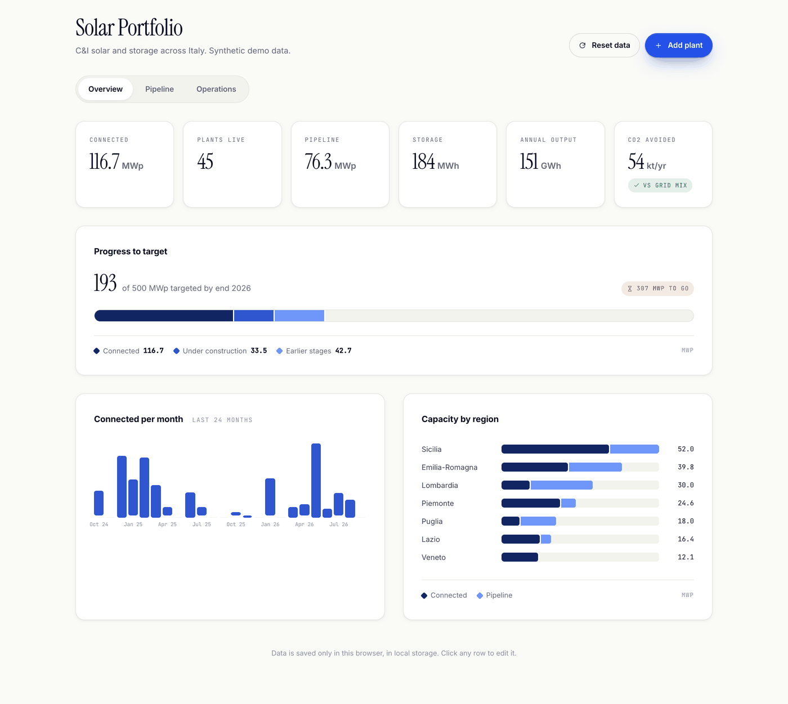
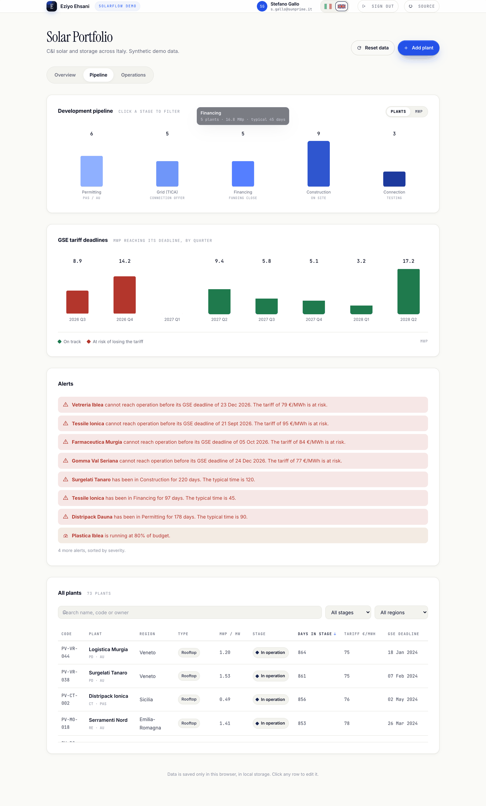
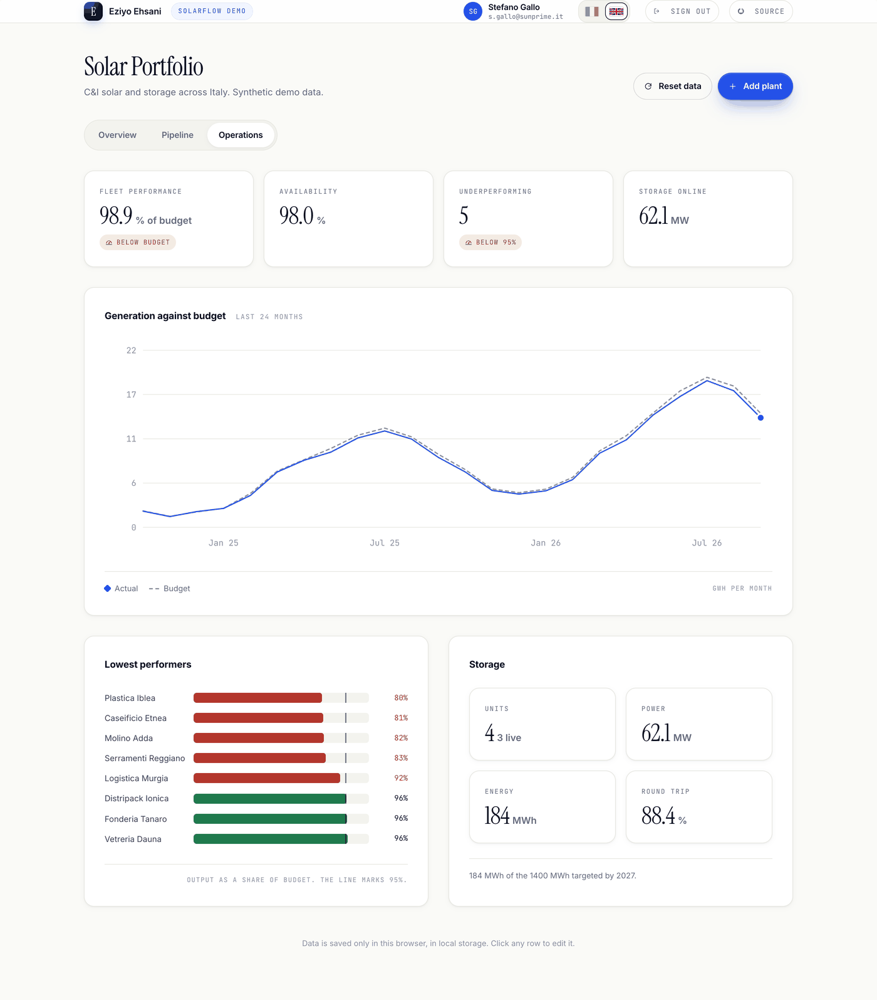
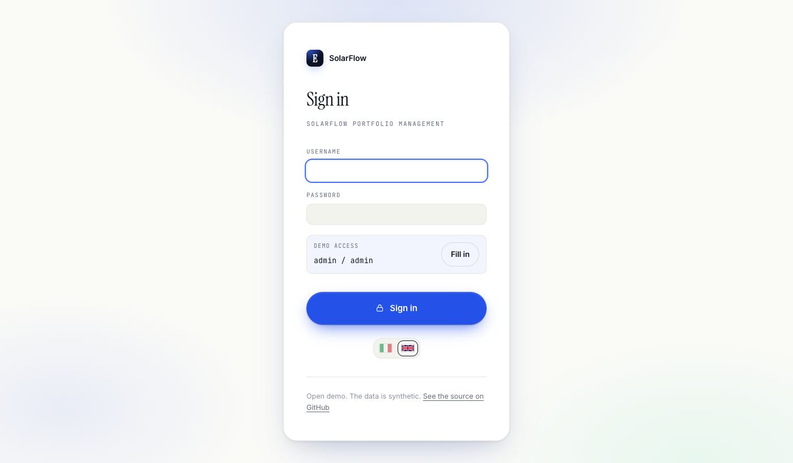

# SolarFlow

A portfolio management dashboard for commercial and industrial solar and battery
storage projects, from permitting through to the operating fleet. One HTML page,
no framework, no dependencies, no build step.



---

## The problem

A commercial solar plant does not fail all at once. It moves through permitting,
grid connection, financing, construction and finally operation, and at every
handover it can quietly stall.

Most teams track this in a spreadsheet. In a spreadsheet, a project that has sat
in the same stage for four months looks exactly like one that arrived yesterday.
Nothing tells you that a grid connection is overdue, or that a plant will miss
the deadline on the incentive tariff it won at auction.

SolarFlow puts the whole portfolio on one screen and applies a small set of
explicit rules to it.

## The pipeline it models

The stages follow how a commercial plant is actually developed in Italy.

| Stage | Typical duration | What it means |
|---|---|---|
| Permitting | 90 days | PAS for smaller rooftop systems, Autorizzazione Unica for larger or ground-mounted ones |
| Grid connection (TICA) | 60 days | The connection offer from the distributor, accepted and paid |
| Financing | 45 days | Funding close |
| Construction | 120 days | On site |
| Connection | 30 days | Physical connection and testing |
| In operation | — | Producing and earning |

Revenue comes from a GSE feed-in tariff won at auction. A tariff carries a
deadline: reach operation before it or lose the tariff. That deadline drives the
most important view in the tool.

## Features

### Overview

Portfolio KPIs, progress against a 500 MWp target broken into connected, under
construction and earlier stages, capacity connected per month over two years,
and capacity by region.

### Pipeline



A funnel across the five development stages, switchable between plant count and
MWp, and clickable to filter the table. Beside it, **MWp reaching its GSE tariff
deadline per quarter, split into on track and at risk** — the chart that decides
where attention goes. Then the alert list and the full plant table, with search,
filters by stage and region, and sorting on any column.

### Operations



The owned fleet: actual generation against budget over 24 months, the eight
lowest performing plants with the 95% threshold marked, fleet availability, and
the storage units in MW and MWh.

## The rules

The analytics are rules, not a model, so every flag can be explained to the
person whose project it is.

| Flag | Rule |
|---|---|
| **Stuck** | In its current stage for more than 1.5× the typical duration of that stage |
| **Late** | Target date has passed and the plant is not yet in operation |
| **Tariff at risk** | Cannot reach operation before the GSE deadline, given the days still needed for the remaining stages |
| **Underperforming** | Producing below 95% of budget |

Each one surfaces as an alert, and clicking an alert opens the plant it refers to.

## Signing in



```
username: admin
password: admin
```

The gate shows those credentials itself, with a **Fill in** button that types them
for you, because this demo is meant to be opened by anyone.

**So it is a demonstration of a sign-in, not a barrier.** The check runs in the
browser. What the code compares is a single SHA-256 digest of
`username + "\n" + password`, never a stored password, but the credentials are
public and anyone who opens DevTools can get past it anyway. Real protection would
need a server or a hosted auth service.

To change the credentials, regenerate the digest in `app.js` and update the hint in
`index.html`:

```bash
node -e 'console.log(require("crypto").createHash("sha256").update("NEW_USER\nNEW_PASSWORD").digest("hex"))'
```

The session lasts until the tab is closed.

## Running it

No install, no build.

```bash
git clone https://github.com/eziyoo/solarflow-agent.git
cd solarflow-agent
python3 -m http.server 8000
```

Then open <http://localhost:8000>.

It has to be served over `http://localhost` or https. Opening `index.html`
straight from the file system will not sign you in, because `crypto.subtle` is
only available in a secure context.

## How it is built

```
index.html    markup, the icon sprite, the sign-in panel and the three tabs
styles.css    design tokens, a small reset, then the dashboard
app.js        data model, the rules, the charts, the sign-in gate
i18n.js       the bilingual engine and its dictionary
```

- **Around 70 plants, generated from a seeded PRNG** (`mulberry32`), so the
  portfolio is identical on every machine and in every screenshot. No fixture
  file to maintain.
- **Time series are derived, never stored.** A plant's monthly output is a pure
  function of its seed, capacity, regional yield and the month, so `localStorage`
  holds records only and the charts stay stable across reloads.
- Plants can be added, edited and deleted. Edits persist in the browser; **Reset
  data** restores the seeded portfolio.
- Every chart is hand-drawn: CSS for the bars and stacks, inline SVG for the line
  chart. No charting library.

## Design notes

- The five development stages are an **ordinal one-hue ramp**, light to dark,
  because a pipeline is ordered and five unrelated colours would hide that. The
  ramp is validated for monotone lightness, visible steps between neighbours and
  contrast against the page.
- **Status colours are reserved** for state — on track, at risk, underperforming
  — and are never reused as another data series.
- **Text always wears text colours**, never the colour of the series next to it.
  A stage chip carries a small swatch and keeps its label in ink.
- Every input, button, table header and clickable row has a visible focus state.
  There are no browser `alert()` or `confirm()` dialogs: destructive actions use
  a two-step confirm on the button itself, and `Escape` closes the modal.

## Languages

English and Italian, switchable from the flags in the top bar. Dates and numbers
follow the language (`18 gen 2024` and `116,7` in Italian). The choice is
remembered per browser.

The dictionary in `i18n.js` is keyed by the English source text, so the markup
carries no per-element keys — the engine walks the text nodes once, remembers the
English and swaps in the Italian. Strings it does not know are left alone, which
is what keeps tool names intact.

---

## A note on the data

Every plant, name, tariff and reading in this repository is **synthetic**,
generated by the seeded function in `app.js`. It is shaped to look like a real
Italian C&I solar portfolio so the tool can be judged properly, but it describes
no real company, site or project.

This is a demonstration of process mapping and rapid prototyping, not a product.

## Licence

MIT. See [LICENSE](LICENSE).
